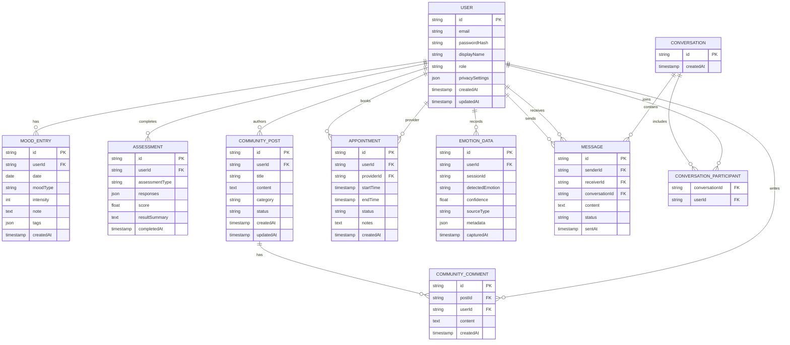
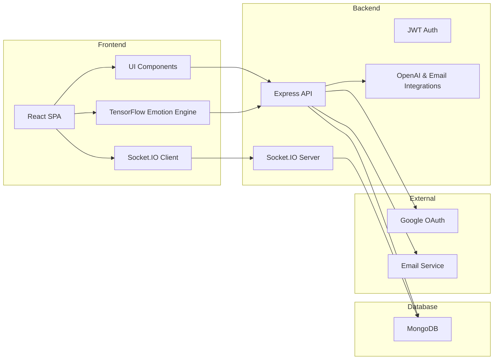
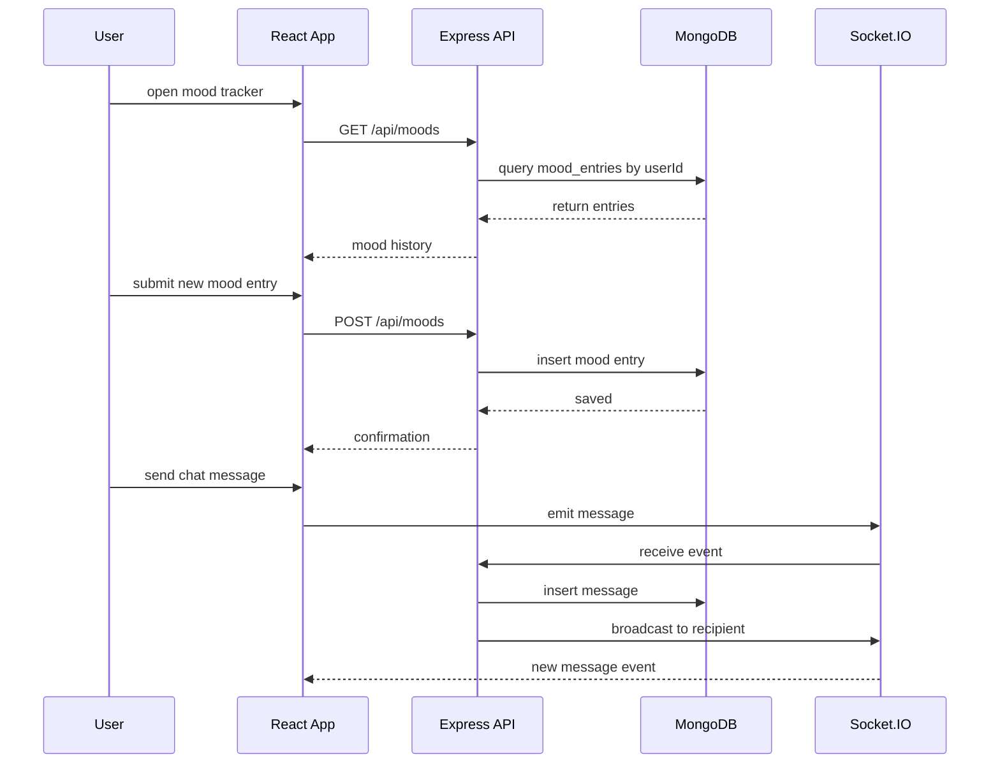

@/backend/  @/frontend @/backend/config/ @/backend/controllers/ @/backend/middlewares/ @/backend/models/ @/backend/routes/ @/backend/utils/ 

# GlowSpace - Mental Health Platform

A comprehensive MERN stack mental wellness platform that supports emotional wellbeing through AI-powered emotion detection, mood tracking, real-time chat support, and personalized counseling services.

## 🌟 Features

- **Emotion Detection**: Real-time facial emotion recognition using TensorFlow.js
- **Mood Tracking**: Interactive mood calendar with analytics
- **Real-time Chat**: Socket.IO powered chat support system
- **Counseling Services**: Appointment booking and scheduling
- **Mental Health Assessments**: AI-powered analysis of trauma, medication history, and voice assessments
- **Personalized Dashboard**: GPT-powered recommendations and insights
- **Gamified Healing**: Interactive healing games and positive streak challenges
- **Multi-auth Support**: Email/password and Google OAuth authentication

## ✅ Functional Requirements
GlowSpace must allow users to register, log in, and securely manage their mental wellness profile.

- User authentication and authorization with email/password and Google OAuth.
- Profile management with display name, bio, privacy settings, and notification preferences.
- Mood tracking workflows for creating, editing, deleting, and viewing mood check-ins.
- Assessment workflows for completing questionnaires, saving responses, and reviewing results.
- Community posting and commenting for peer support and moderated discussions.
- Real-time chat messaging between users or support personnel via Socket.IO.
- Appointment scheduling, rescheduling, cancellation, and reminders for counseling sessions.
- Emotion detection capture from video or camera input with AI-assisted labeling.
- Dashboard analytics showing trend summaries, streaks, and wellbeing insights.
- REST API endpoints for frontend interactions and integrations with external services.

## ⚙️ Non-Functional Requirements
GlowSpace must be secure, responsive, and reliable while protecting sensitive user and mental health data.

- Performance: fast page loads (<2s), quick API response times, and efficient dashboard rendering.
- Security: HTTPS transport, JWT session security, data validation, and protection against XSS/CSRF/injection attacks.
- Privacy: limited collection of personal data, user consent, and support for data deletion/export requests.
- Scalability: ability to grow with more users, chat volume, and data without major rearchitecture.
- Availability: reliable operation for core features, graceful degradation for non-critical services, and error monitoring.
- Accessibility: keyboard navigation, screen reader compatibility, adequate contrast, and mobile responsiveness.
- Maintainability: clean modular code, documented API and architecture, and reusable components.
- Compliance: consider GDPR/HIPAA-style protections for sensitive health and emotional data.

## 🏗️ Architecture

### Frontend (React)
- React 18 with Context API
- TensorFlow.js for emotion detection
- Socket.IO client for real-time features
- Tailwind CSS + GSAP for animations
- React Router for navigation

### Backend (Node.js/Express)
- RESTful API with Express
- MongoDB with Mongoose ODM
- Socket.IO for real-time communication
- JWT authentication
- Multer for file uploads
- Integration with OpenAI GPT API

### Database (MongoDB)
- User management
- Emotion and mood data
- Chat messages
- Appointments and assessments
- Gamification data

### Database Design
GlowSpace uses MongoDB to store user data and application state in a document-based model. The database is organized into collections that map directly to major features.

Key collections and their purpose:
- `users`: stores account, profile, authentication, and privacy settings.
- `mood_entries`: saves daily mood check-ins, intensity, notes, tags, and timestamps.
- `assessments`: records completed mental health surveys, responses, scores, and summaries.
- `community_posts`: holds community discussion posts, categories, status, and author references.
- `community_comments`: contains comments linked to community posts for conversation threads.
- `appointments`: tracks booking details, provider/user relations, schedules, and appointment status.
- `emotion_data`: stores AI emotion detection results including inferred emotion labels, confidence, and source metadata.
- `messages`: logs chat messages for real-time support and conversation history.

Why this design matters for public users:
- It keeps the platform modular and easy to extend. Each feature has its own collection, so new features like recommendations or peer groups can be added without changing existing data structures.
- It supports fast lookups for user history, dashboard summaries, and chat retrieval by indexing core fields such as `userId`, `createdAt`, and `conversationId`.
- Sensitive mental health and personal data are separated by collection and accessed through authenticated backend routes, which makes the app easier to secure and audit.

How the data connects:
- A single user can have many mood entries, assessments, posts, appointments, detected emotion sessions, and messages.
- Community posts and comments are linked by `postId`, creating a thread model for group support.
- Appointments and messages link back to users to support scheduling and chat workflows.

#### Database Diagram
Below is the GlowSpace database ER diagram, showing collections and the relationships between users, mood data, community posts, appointments, emotion sessions, messages, and conversations.



### High-Level Architecture
GlowSpace is built as a modern web application with three main zones: frontend, backend, and database. The frontend is a React SPA that handles user interaction, TensorFlow emotion capture, and live updates. The backend is an Express API that manages business logic, authentication, real-time chat, and external services. MongoDB stores the platform's data.



### Low-Level Design
At the low level, GlowSpace maps UI features to backend controllers and database collections. This structure makes it easy to understand how data flows from the client through the API to the database and back.



These diagrams help public users understand both the broad architecture and the detailed runtime flow behind GlowSpace.

This design is intentional for a mental wellness platform: it balances flexible schema support with clear boundaries between features, while still enabling strong user-specific reporting and analytics.

## 📁 Project Structure

```
GlowSpace-Mental Health Platform/
├── frontend/                    # React application
│   ├── public/                 # Static files
│   ├── src/                    # Source code
│   │   ├── components/         # Reusable components
│   │   │   ├── Dashboard/      # Dashboard components
│   │   │   ├── Chat/          # Chat components
│   │   │   ├── EmotionDetector/# Emotion detection
│   │   │   ├── Navbar/        # Navigation
│   │   │   └── Footer/        # Footer
│   │   ├── contexts/          # React contexts
│   │   ├── pages/             # Page components
│   │   ├── tests/             # Test files
│   │   └── App.js             # Main app component
│   └── package.json           # Frontend dependencies
├── backend/                    # Node.js/Express API
│   ├── controllers/           # Route controllers
│   ├── middlewares/           # Custom middleware
│   ├── models/               # Database models
│   ├── routes/               # API routes
│   ├── utils/                # Utility functions
│   ├── uploads/              # File uploads
│   ├── config/               # Configuration files
│   ├── .env.example          # Environment variables template
│   ├── package.json          # Backend dependencies
│   └── server.js             # Main server file
├── docs/                      # Project documentation
├── README.md                  # This file
└── .gitignore                # Git ignore rules
```

## 🚀 Getting Started

### Prerequisites
- Node.js (v16 or higher)
- MongoDB
- Git

### Installation

1. Clone the repository
```bash
git clone <repository-url>
cd GlowSpace-Mental Health Platform
```

2. Install backend dependencies
```bash
cd backend
npm install
```

3. Install frontend dependencies
```bash
cd ../frontend
npm install
```

4. Set up environment variables
```bash
# Copy the example environment file
cp backend/.env.example backend/.env

# Edit the .env file and fill in your values:
# - MongoDB URI
# - JWT secrets
# - Google OAuth credentials
# - Email configuration
# - OpenAI API key (optional)
```

5. Start MongoDB (if running locally)
```bash
# Using MongoDB Community Server
mongod

# Or using Docker
docker run -d -p 27017:27017 --name mongodb mongo:latest
```

6. Start the development servers
```bash
# Terminal 1: Backend server (from backend directory)
cd backend
npm run dev

# Terminal 2: Frontend server (from frontend directory)
cd frontend
npm start
```

7. Open your browser and navigate to `http://localhost:3000`

## 📚 Documentation

- [Phase 0: Strategy & Requirements](docs/PHASE_0_Strategy_Requirements.md)
- [Phase 1: Project Structure](docs/PHASE_1_Project_Structure.md)
- [API Documentation](docs/API_Documentation.md) (Coming Soon)
- [Database Schema](docs/DATABASE_Schema.md) (Coming Soon)
- [Deployment Guide](docs/DEPLOYMENT_Guide.md) (Coming Soon)

## 🤝 Contributing

1. Fork the repository
2. Create a feature branch
3. Make your changes
4. Submit a pull request

## 📄 License

This project is licensed under the MIT License.

## 🔗 Links

- [Socket.IO Documentation](https://socket.io/docs/)
- [TensorFlow.js](https://www.tensorflow.org/js)
- [OpenAI API](https://openai.com/api/)

---

**GlowSpace** - Illuminating the path to mental wellness 🌟
